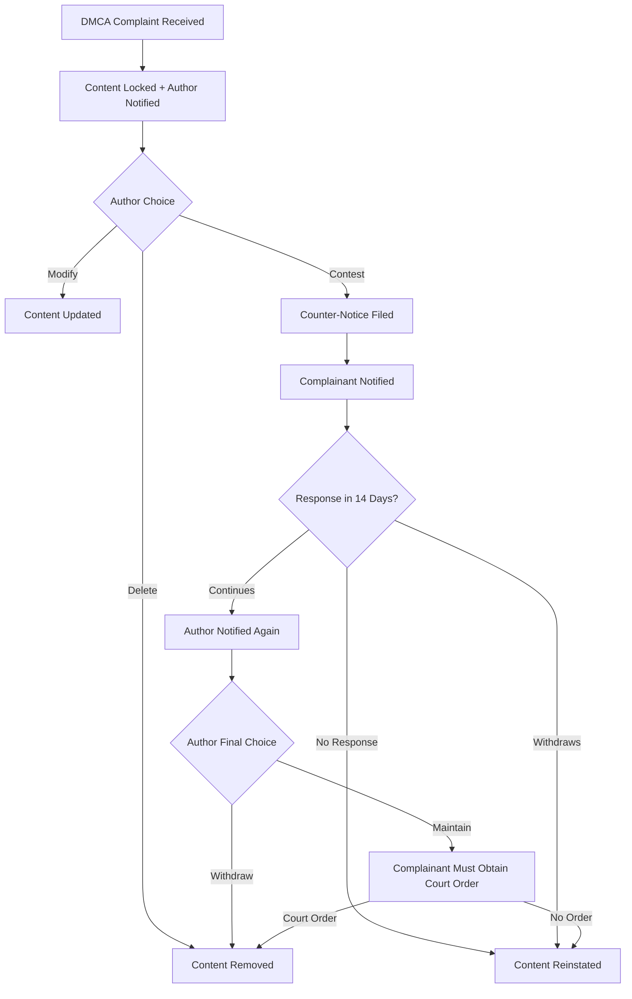

# Terms of Service

_Last updated: September 16, 2025_

Welcome to Writers Grove. By accessing or using our services (“Services”), you agree to these Terms of Service (“Terms”). Please read them carefully.

---

## 0. Our Legal Position

Writers Grove is a **U.S.-based company located in Michigan**, with servers located in Ohio.  
We do **not** market to, advertise to, or actively solicit customers in the **UK, EU, or Canada**. We do not recognize those jurisdictions as having authority over us.

That said, we recognize frameworks such as **GDPR (EU/UK)**, **UK Data Protection Act**, and **Canada’s PIPEDA** as **best practices**. While not legally obligated to follow them, we voluntarily align our practices with their principles where reasonable, in the interest of transparency and consumer trust.

All disputes will be governed by the laws of the State of Michigan, United States.

---

## 1. Accounts

- You must provide accurate information when creating an account.
- You are responsible for maintaining the confidentiality of your account and password.
- You must be at least **13 years old** to use our Services.
- We reserve the right to suspend or terminate accounts that violate these Terms.

---

## 2. Content and Ownership

- **Your Content**: You retain full ownership of all works you publish on Writers Grove.
- **License to Us**: By publishing on Writers Grove, you grant us a **limited, non-exclusive license** to host, display, and distribute your works on our platform.
- **Export Rights**: You may export your works (e.g., EPUB, PDF, Markdown) at any time for backup or use elsewhere.
- **Removal**: You may delete your works or your account at any time. Deleted data will be permanently removed from our servers after a 30-day grace period.

---

## 3. Payments and Subscriptions

- **Subscription Fee**: Authors may subscribe for $14.95/month.
- **Free Tier**: Free users are supported by advertising revenue. Ads may be shown on free-tier pages.
- **Paid Tier**: Paid authors keep 100% of their monetization (ads, tips, Stripe, PayPal).
- **Refunds**: We do not provide prorated refunds. You may cancel anytime and retain access until the end of your billing period.
- **Billing Questions**: All billing or payout questions should be directed to **billing@writersgrove.net**.

### Chargebacks, Refunds, and Account Suspension

We take chargebacks very seriously because they impose costs and legal risks on the platform.

- **Immediate Suspension:** If a chargeback is initiated, the associated account will be **immediately suspended and locked**. While suspended, the account will have only two options:

  1. **Download Content & Delete Account**
  2. **Contact Support to Resolve the Dispute**

- **14-Day Resolution Window:** The account holder has **14 days** from the suspension date to contact us at **support@writersgrove.net** to resolve the issue.

- **After 14 Days:**

  - If no contact is made, the account will be **permanently deleted**.
  - Content will be **backed up to a private S3 bucket** for a period of **90 days**, during which time it may be made available for download upon request. After 90 days, the backup will be permanently deleted.

- **Refunds:** If you believe a payment was made in error, contact us directly. Refunds may be granted at our discretion. Do not initiate a chargeback—doing so triggers the suspension process above.

- **Ban:** Accounts deleted due to unresolved chargebacks will be **permanently banned** and ineligible for new accounts or referral earnings.

---

## 4. Referral Program

- **Commission**: Earn 10% of subscription fees (after payment processor fees) for each paying author you refer.
- **Lifetime Rule**: Commissions remain valid for the lifetime of the referred account, even if they cancel and later resubscribe.
- **Attribution**: First referrer is locked in. Referrals cannot be stolen or reassigned.
- **Pending Period**: Commissions are pending for 90 days to protect against chargebacks/refunds.
- **Payout Cycle**: Matured commissions are paid monthly via PayPal MassPay.
- **Minimum Payout**: $25.
- **Fraud Prevention**: Self-referrals, duplicate accounts, or fraud result in forfeited commissions and possible account suspension.

---

## 5. Content Guidelines and Moderation

### General Policy

- Writers Grove is designed as a platform for free expression. We do **not** actively moderate content beyond what is legally required.
- Content moderation occurs in three ways:
  1. **Legal Compliance**: DMCA notices, valid court orders, or law enforcement requests.
     > Law enforcement may contact us at **support@writersgrove.net**.
  2. **Community Complaints**: Users may flag content. Complaints are aggregated and acted upon at thresholds.
  3. **Automatic Rules**: Certain complaint categories trigger automatic action.

### Complaint Thresholds

- **10% Complaint Rate**: A warning is sent to the author.
- **25% Complaint Rate**: Content is shadow banned (still visible to the author, hidden from others).

### Automatic Actions

- **NSFW Mislabeling**: Content not marked as NSFW but flagged as NSFW will be shadow banned.
- **Child Harm Content**: Any content depicting the exploitation or harm of children will be **immediately deleted** and reported to authorities.
- **Other Illegal Content**: Removed if required by law (terrorism, hate speech incitement, etc.).

### DMCA Compliance

We comply with the Digital Millennium Copyright Act (DMCA).

- **Takedown Notices**: Send to **dmca@writersgrove.net** or our mailing address.
- **Counter-Notices**: Authors may submit a counter-notice if they believe the takedown is in error. If not challenged, the content remains removed.

---

## 6. Community Guidelines

- **Stories vs. Community**: Stories are not moderated beyond the rules above. Community spaces (forums, comments, etc.) are moderated for conduct.
- **No Drama Policy**: Hate speech, harassment, or disruptive behavior is not tolerated. Warnings and bans may be issued.

---

## 7. Privacy

Our handling of your data is explained in the [Privacy Policy](privacy.md). By using Writers Grove, you agree to its terms.

---

## 8. Disclaimer of Warranties

- Writers Grove is provided on an **“as-is”** and **“as available”** basis.
- We do not guarantee uptime, availability, or revenue.
- We disclaim all warranties, express or implied, to the maximum extent permitted by law.

---

## 9. Limitation of Liability

To the fullest extent permitted by law:

- Writers Grove shall not be liable for indirect, incidental, or consequential damages.
- Our total liability shall not exceed the greater of $100 or the amount you paid us in the 12 months before the claim.

---

## 10. Termination

- You may terminate your account at any time.
- We may suspend or terminate your account if you violate these Terms, engage in fraud, or create legal risks for us.

---

## 11. Dispute Resolution & Governing Law

- These Terms are governed by the laws of the State of Michigan, United States.
- Any disputes shall be resolved exclusively in the state or federal courts located in Michigan.

---

## 12. DMCA Complaints

We comply with the Digital Millennium Copyright Act (DMCA). Our process is designed to be transparent and fair for both copyright holders and creators, following a model similar to YouTube’s.

### DMCA Process

1. **Initial Takedown**

   - When we receive a valid DMCA complaint, the reported content will be **immediately locked** (unavailable to the public).
   - The author will be notified of the complaint and the reason provided by the complainant.

2. **Author Options**  
   The author may then choose one of the following:

   - **Delete** the content permanently.
   - **Modify** the content to address the complaint.
   - **Contest** the complaint by filing a counter-notice.

3. **Counter-Notice Procedure**

   - If a counter-notice is filed, we will notify the original complainant with the author’s response.
   - The complainant then has **14 days** to either withdraw the complaint or pursue legal action.
   - If the complainant withdraws or does not respond within 14 days, the content will be **reinstated**.

4. **If the Complainant Continues**
   - If the complainant insists on the takedown, the author will be notified and given a final choice:
     - **Withdraw** the content permanently.
     - **Maintain** the content and proceed to legal resolution.
   - At this stage, the complainant will need to provide a valid **court order** for the content to remain locked or permanently removed.

### Notes

- Abuse of the DMCA process (false or malicious claims) may result in suspension of the complainant’s ability to file future claims.
- Repeated copyright violations by an author may result in account suspension or termination, as required by the DMCA.
- All DMCA notices and counter-notices must comply with the requirements of **17 U.S.C. § 512**.

**Contact for DMCA Notices**:

- Email: **dmca@writersgrove.net**
- Mail: Writers Grove, P.O. BOX 222, Brooklyn, MI 49230, USA

## 13. Changes to These Terms

We may update these Terms from time to time. Significant changes will be communicated via email or prominent notice on our site. Continued use of the Services after changes means you accept the new Terms.

---

## 14. Disclosures

To ensure clarity and protect both authors and readers, certain types of content must be clearly disclosed:

- **NSFW Content**: Any content that contains adult themes, sexual material, graphic violence, or otherwise not suitable for all audiences must be clearly marked as **NSFW**. Failure to properly label NSFW content may result in the content being shadow banned or removed.

- **AI-Generated Content**: Any content substantially generated or assisted by artificial intelligence tools must be clearly labeled as **AI-Generated**. Authors are responsible for accurate disclosure. This allows readers to make informed choices about the works they engage with.

Writers Grove reserves the right to take automated moderation action (warnings, shadow bans, or removal) on content that fails to meet these disclosure requirements.

## 15. Contact Information

Writers Grove  
P.O. BOX 222  
Brooklyn, MI 49230  
United States

Phone: **1-888-836-5902**  
Email: **privacy@writersgrove.net** (privacy/data requests)  
Email: **billing@writersgrove.net** (billing, payments, referral payouts)  
Email: **support@writersgrove.net** (general support, refunds, law enforcement contact)  
Email: **dmca@writersgrove.net** (DMCA notices & counter-notices)

---
